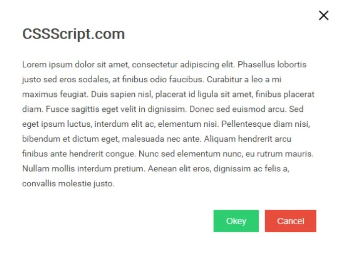
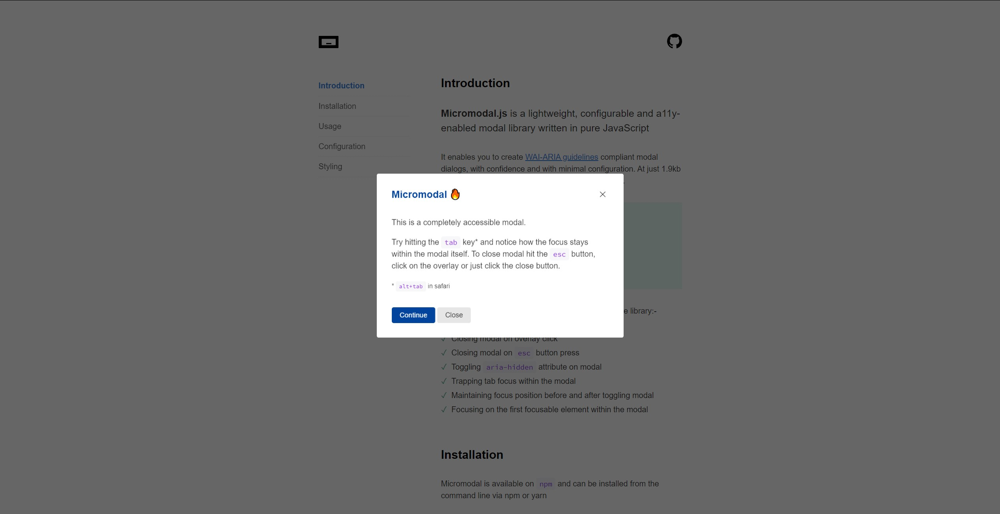

# Modal
Gitet használj! A repository-d neve: **modal**. Case sensitive-en.

Egy modalt, azaz felugró ablakot kell készítened.  
A modal főbb részei: 
- bezárás gomb
- fejléc
- tartalmi rész
- lábléc (alsó gombok)
- **A modalt nem dinamikusan, JavaScriptből kell létrehozni, hanem már eleve a DOM része lehet!**

- A modalt bármilyen gomb vagy egyéb elem eseményéhez hozzá lehessen rendelni, tehát pl. ha rákattintok egy gombra, akkor jelenik meg
- A modal mind vertikálisan, mind horizontálisan középre kell legyen pozicionálva
- Amikor a modal megnyílik, a hátteret egy részben áttetsző réteggel le kell takarni, a modalt focus-ba kell helyezni

- A modal egy egyszerű animáció kíséretében jelenjen meg (pl. fade)
- A modal egy egyszerű animáció kíséretében tűnjön el bezáráskor
- A modalon kívülre kattintva is automatikusan záródjon be a modal, tűnjön el az overlay réteg