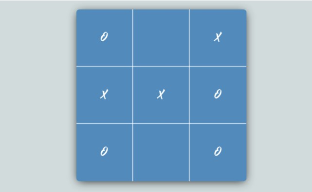

# TicTacToe

Gitet használj! A repository-d neve: **tictactoe**. Case sensitive-en.

Egy egyszerű 3x3-as amőbajátékot kell készítened.  
   
A szabályok a jól ismertek: két játékos van. Az egyik a "0", a másik az "X" jelet használja játék közben. A játékosok felváltva lépnek, azaz helyeznek el egy-egy jelet a 3x3-as táblázat egy cellájában.   
Az a játékos győz, akinek előbb sikerül egymás alatt, mellett vagy átlósan elhelyezni a 3 azonos jelet.     
A játék végén ki kell írni, hogy melyik jellel játszó játékos győzött, és egy gomb megnyomására új játékot lehet indítani.