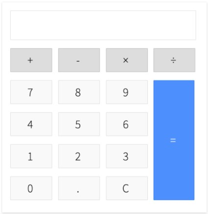

# Calculator

Git-et használj! A repository-d neve: **calculator**. Case sensitive-en.

Készítsd el az alábbi számológép design-ját html és css segítségével (Ne táblázatot hanem diveket használj!):  
  
    
Ha elkészült a design írd meg azt a javascript kódot ami a számológép megfelelő működését megvalósítja.  

Követelmények: 
- Az *eval* metódus használata SZIGORÚAN TILOS! Most és mindörökké!
- Egyelőre nem kell foglalkozni azzal az esettel, hogy mi történik, ha két műveleti jel van egymás után. Ilyen esetekben dobhattok hibát. A felső input mezőben jelenjen meg az ˙ERROR` szöveg. 
- Egymás után több művelet is végrehajtható. Pl.: 10-20+3*2. Ilyen esetben a precedencia szabályokra még nem kell odafigyeled, csak balról jobbra, sorba értékelődjenek ki a műveletek!
- A számok, és műveleti jelek a felső input mezőben jelenjenek meg
- Az egyenlőségjelre kattintva az inputban megjelenik a művelet(ek) eredménye
- A `C` gomb törli az input mező tartamát