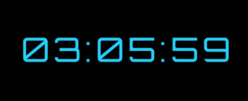

# Clock

Git-et használj! A repository-d neve: **clock**. Case sensitive-en.

Készítsd egy hasonló órát JavaScript segítségével.   

- Mutassa az órát, percet, másodpercet
- Az óra a user által használt időzóna szerint jelenítse meg az időt
- Az óra 24 órás formátumot használjon minden esetben
- A színeket szabadon választhatod meg
- Az óra a képernyő közepén jelenjen meg, azaz mind vertikálisan, mind horizontálisan legyen középre igazítva minden nézetben
- A body pontosan 1 képernyő széles és magas legyen minden nézetben, ezt töltse ki a háttérszín
- Használd a Cyberverse betűtípust
- A betűméretet te választhatod meg

