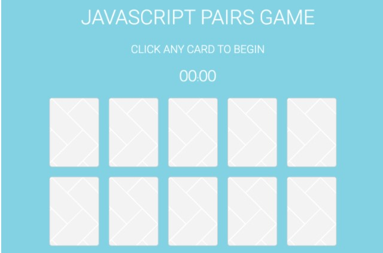

# Pair game

Git-et használj! A repository-d neve: **pair-game**. Case sensitive-en.

- Egy *"Keresd a párját"* játékot kell készítened
- A játékban két sorban soronként 5 azaz összesen 10 darab kártya látható
- A játék kezdetekor kártyák le vannak fordítva
A kártyák másik oldala egy egyszerű ábrát tartalmaz
- Az ábrák szabadon választható képek, vagy akár ikonok is lehetnek a könnyebb felismerhetőség végett
- Minden ábrából összesen két darab van 
- Amikor a játékos rákattint egy kártyára az egy egyszerű animáció kíséretében megfordul, felfedve az ábrát
- Az első kártyára való kattintáskor elindul egy számláló, ami a játékidőt mutatja perc/másodperc formában
- Amennyiben egymás után két felfordított kártyán ugyanaz az ábra szerepel, azokat felfordítva kell hagyni a játék végéig, többet nem lehet rájuk kattintani
- Amennyiben a két ábra eltérő, mind a kettőt automatikusan vissza kell fogatni
- A játéknak akkor van vége, amikor az összes kártya képes oldala látszik
- A számláló a játék végén megáll
- 5 másodperc múlva a számláló nullázódik, és az összes kártya visszafordul, kezdődhet egy új játék
 

