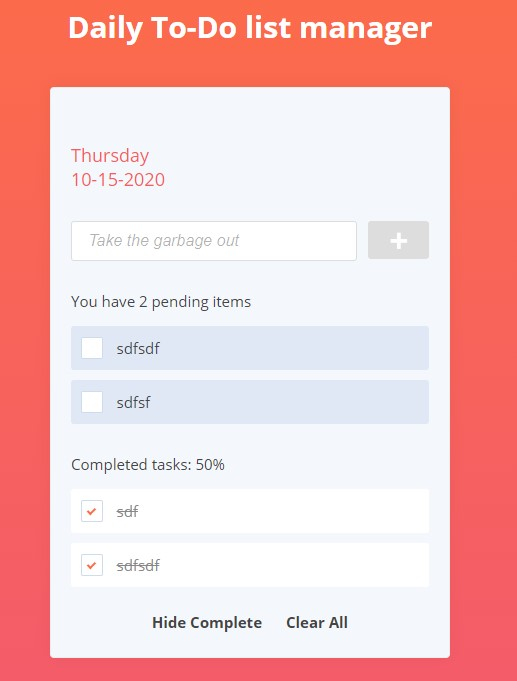
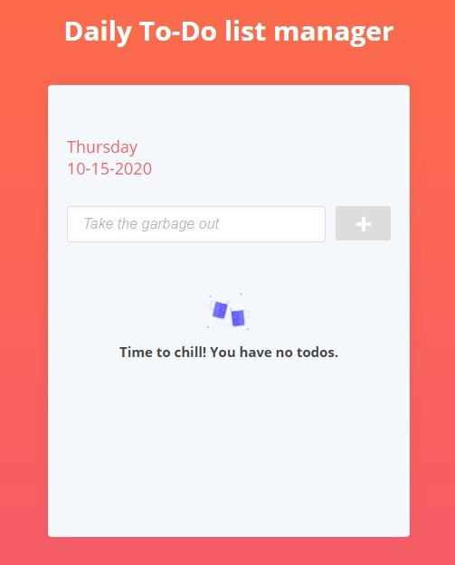

# Todo list

Git-et használj! A repository-d neve: **todo**. Case sensitive-en.

Egy Teendőlista alkalmazást kell lefejlesztened. 
Alkalmazás design-ját és működését az alábbi ábrák szemléltetik:  
    
A már elvégzett teendők:   
   
Üres teendőlista:    
    

- A színeket, ikonokat és a betűtípust szabadon választhatod
- A checkboxoknak nem kell egyedi designt készíteni.  
- Az alkalmazás localStorage-ben tárolja a teendőket.
- Az alkalmazás indításkor ellenőrzi vannak-e mentett teendők, ha igen, akkor betölti őket storage-ból.  
- Felül szerepelnie kell a jelenlegi dátumnak
- Az input mező placholdere: Take the garbage out
- A plusz jelre kattintva egy animáció kíséretében megjelenik az új teendő a listában, az input tartalma törlődik 
- A teendő lista feletti mondatban (You have X pending items) látható, hogy szerepel a teendők száma, ez dinamikusan frissüljön mindig
- H egy teendő fölő visszük a kurzort, egy animáció kíséretében megjelenik a kuka ikon, amire kattintva törlődik a teendő
- A teendő előtti checkboxot bejelölve az adott teendő elvégzett lesz, a listáról eltűnik
- A Show/Hide Complete szövegre kattintva lehet megjeleníteni/elrejteni a már elvégzett teendőket
- A Clear All-ra kattintva a még el nem végzett összes teendő törlésre kerül